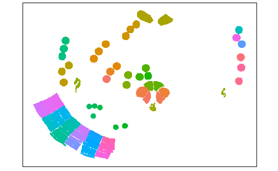

# SpatialOmicsOverlay Workshop
## Bioconductor Smorgasbord 2023

This package is a template for building a Bioconductor workshop. The package
includes Github actions to:

## Instructor name and contact information
* Megan Vandenberg, NanoString Technologies, Inc. <mgvandenberg@nanostring.com>
* Maddy Griswold, NanoString Technologies, Inc.
* Stephanie Zimmerman, NanoString Technologies, Inc.

## Workshop Description
 This workshop will introduce users to the NanoString R package SpatialOmicsOverlay, which is useful in analyzing images from our GeoMx (R) Digital Spatial Profiler spatial biology platform.

 Participants will learn how to interact with OME-TIFF file types. The vignette data is from our repository of GeoMx datasets, called the [Spatial Organ Atlas](https://nanostring.com/products/geomx-digital-spatial-profiler/spatial-organ-atlas/). Each organ profiled in NanoString’s Spatial Organ Atlas (SOA) consists of freely available downloadable data files on 4-13 sections. For this vignette, users will be exploring the mouse brain.


## Resources
* [SpatialOmicsOverlay on Bioconductor](https://bioconductor.org/packages/release/bioc/html/SpatialOmicsOverlay.html)
* [Spatial Organ Atlas data on NanoString's website](https://nanostring.com/products/geomx-digital-spatial-profiler/spatial-organ-atlas/)
* [Source code](https://github.com/Nanostring-Biostats/SOOBiocWorkshop)
* [Learn more about the GeoMx DSP](https://nanostring.com/products/geomx-digital-spatial-profiler/geomx-dsp-overview/)


## Pre-requisites
* Basic knowledge of R programming
* Docker
* Space on machine hosting Docker image to download a 13 GB demo data file


## To Docker image:

```sh
docker run -e PASSWORD=<yourchosenpassword> -p 8787:8787 ghcr.io/nanostring-biostats/soobiocworkshop
```
Once running, navigate to http://localhost:8787/ and then login with `rstudio`:`<yourchosenpassword>`. 


*NOTE*: Running docker that uses the password in plain text like above exposes the password to others 
in a multi-user system (like a shared workstation or compute node). In practice, consider using an environment 
variable instead of plain text to pass along passwords and other secrets in docker command lines. 


Picture of plot


1. Set up bioconductor/bioconductor_docker:devel on Github resources
2. Install package dependencies for your package (based on the `DESCRIPTION` file)
3. Run `rcmdcheck::rcmdcheck`
4. Build a pkgdown website and push it to github pages
5. Build a docker image with the installed package and dependencies and deploy to [the Github Container Repository](https://docs.github.com/en/packages/working-with-a-github-packages-registry/working-with-the-container-registry#pulling-container-images) at the name `ghcr.io/gihub_user/repo_name`, all lowercase. 

## Responsibilities

Package authors are primarily responsible for:

1. Creating a landing site of their choosing for their workshops (a website). This website should be listed in the `DESCRIPTION` file as the `URL`.
2. Creating a docker image that will contain workshop materials and the installed packages necessary to run those materials. The name of the resulting docker image, including "tag" if desired, should be listed in a non-standard tag, `DockerImage:` in the `DESCRIPTION` file. 

Both of those tasks can be accomplished using the Github actions included in this template package. The vignette accompanying this package describes how to accomplish both of these tasks.

## Details

For detailed instructions, see the `How to build a workshop` article/vignette.

## Results of successful deployment

- A working docker image that contains the installed package and dependencies.
- An up-to-date `pkgdown` website at https://YOURUSERNAME.github.io/YOURREPOSITORYNAME/
- Docker image will be tagged with `latest`, `sha-XXXXXX` where `XXXXXX` is the hash of the current `master` commit, and `master`. 


To try with **this** repository docker image:

```sh
docker run -e PASSWORD=abc -p 8787:8787 ghcr.io/bioconductor/buildabiocworkshop
```


## Whatcha get

- https://bioconductor.github.io/BuildABiocWorkshop
- A Docker image that you can run locally, in the cloud, or (usually) even as a singularity container on HPC systems. 
