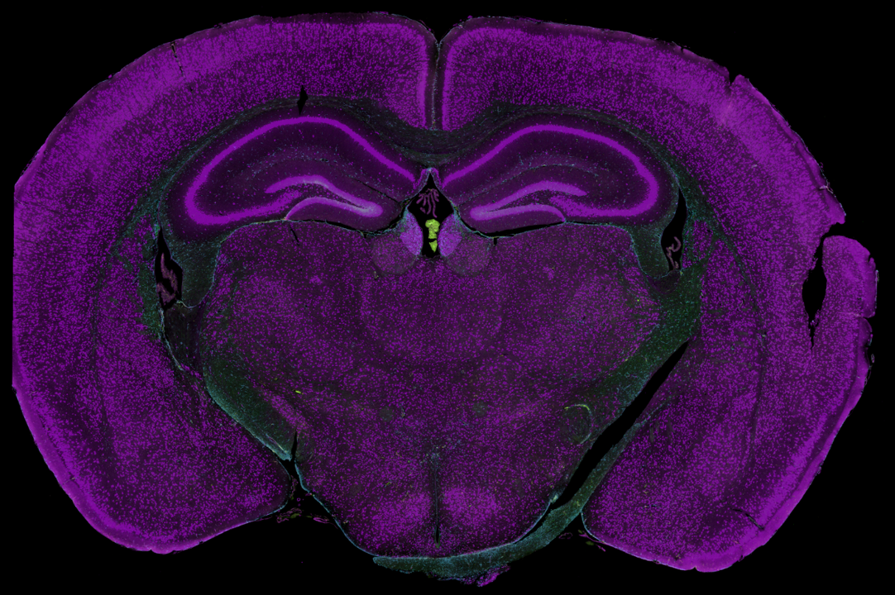

```{r, include = FALSE}
knitr::opts_chunk$set(
  collapse = TRUE,
  comment = "#>"
)
```

# Overview

With GeoMx DSP, regions of interest (ROIs) are selected by the user and then molecularly profiled within each ROI. `SpatialOmicsOverlay` was specifically made to visualize and analyze the free-handed nature of Region of Interest (ROI) selection in a GeoMx experiment, and the immunofluorescence-guided segmentation process. ROIs can be either profiled in the selected area (i.e., geometric profiling) or subdivided based on the visible morphology markers into compartments and profiled separately (i.e., segmented profiling). Probe counts collected from ROIs underly the genomic expression signal. The overlay from the instrument is recreated in the R environment, allowing for plotting overlays with data like ROI type or gene expression. 

This vignette demonstrates how to use OME-TIFF image files generated by the NanoString [GeoMx <sup>&reg;</sup> Digital Spatial Profiler (DSP)](https://nanostring.com/products/geomx-digital-spatial-profiler/geomx-dsp-overview/) instrument to enhance data visualization of your experiments. You will use as a case study one sample of mouse brain. We will be walking through how to plot the image, profiled regions, and their gene expression.

The SpatialOmicsOverlay package is [now available](https://bioconductor.org/packages/release/bioc/html/SpatialOmicsOverlay.html) through Bioconductor.

*Note: Many of the later code chunks have `eval=FALSE`--work through the vignette yourself to see the images and plots!*

# About This Sample

The mouse brain sample in this vignette is one of [four available](https://nanostring.com/products/geomx-digital-spatial-profiler/spatial-organ-atlas/mouse-brain/) from our [Spatial Organ Atlas](https://nanostring.com/products/geomx-digital-spatial-profiler/spatial-organ-atlas/mouse-brain/). While we will be looking at only one sample, any of the data from our freely-downloadable Spatial Organ Atlas samples would also suffice as an alternative.

```{r mouse brain, echo=FALSE, fig.cap="Mouse brain", out.width = '50%'}

```

This coronal section of formalin-fixed, paraffin-embedded (FFPE) adult mouse was visualized with antibodies to:

* NeuN (neuronal nuclei and perinuclear cytoplasm)
* GFAP (astrocytes)
* Iba1 (microglia)
* SYTO83 (nuclei)

This mouse brain features both geometric and segmented ROI profiling. For the segmented profiling, we mainly used NeuN as a morphology marker to segment the neuronal nuclei and neuropil regions on this sample:

* Neuronal nuclei - NeuN+
* Neuropil - NeuN-


# Load Libraries

***Note: We have occasionally observed this error when running `library(SpatialOmicsOverlay)`, which has `RBioFormats` as a dependency:***

```
Error: package or namespace load failed for 'SpatialOmicsOverlay':
  .onLoad failed in loadNamespace() for 'RBioFormats', details:
  call: jclassName(class, class.loader = class.loader)
  error: java.lang.ClassNotFoundException
```

***We theorize this is due to the Dockerized RStudio warming up and downloading the cached RBioFormats jar file, launching the JVM, or other initiating processes. If you are encountering this error, we recommend waiting several minutes between logging into RStudio and running this vignette. We have also had success in repeatedly restarting R (not RStudio) and running the `Load Libraries` chunk again. If the issue persists, you may consider generating a new container from the Docker image. Finally, it may be helpful to wait until the RBioFormats cached jar file is fully in place before loading SpatialOmicsOverlay; see the following code chunk.***

```{r alternative library load}
# fn <- "~/.cache/R/RBioFormats/bioformats_package_6.12.0.jar"
# file.exists(fn, recursive =TRUE)
# 
# if (file.exists(fn)) {
#   print(file.info(fn)$size)
#   if(file.info(fn)$size == 43081858) {
#     library(SpatialOmicsOverlay)
#   }
# }
```


```{r Load Libraries}
library(rJava)
library(RBioFormats)
library(SpatialOmicsOverlay)
library(GeomxTools)
```


# Data Ingestion

Files needed:

1. OME-TIFF from GeoMx instrument. (Other OME-TIFFs should work with custom parsing functions.)
2. Lab Worksheet from instrument readout.
3. Annotation file(s):
    - Lab Worksheet
    - GeomxSet Object (see [GeomxTools](http://www.bioconductor.org/packages/release/bioc/html/GeomxTools.html) and [GeoMxWorkflows](https://www.bioconductor.org/packages/release/workflows/html/GeoMxWorkflows.html) for more info)
    - Annotations from DSPDA (DSP Data Analysis software)

In this example, we are downloading a TIFF image from AWS S3, but this variable is simply the file path to an OME-TIFF.

***This function will be downloading a 13 GB file and will keep a 4 GB file in BiocFileCache. This download should take ~15 minutes, but you will only have to download once. Note this will download inside of the Docker image, but requires sufficient space on your device hosting the image.***

```{r tiff file}
tifFile <- downloadMouseBrainImage()
tifFile
```

`downloadMouseBrainImage()` will download files, in this workshop, to the `/home/rstudio/.cache/R/SpatialOmicsOverlay/` folder.

Reading in the SpatialOverlay object can be done with or without the image. We will start without the image, as that can be added later. 

If `outline = TRUE`, only ROI outline points are saved. This decreases memory needed and figure rendering time downstream. If ANY ROIs are segmented in the study, outline will be FALSE. In this particular example, there are segmented ROIs, so we set `outline = FALSE`.

```{r read in data}
muBrainLW <- system.file("extdata", "muBrain_LabWorksheet.txt",
                        package = "SpatialOmicsOverlay")
muBrain <- readSpatialOverlay(ometiff = tifFile, annots = muBrainLW,
                             slideName = "4", image = FALSE,
                             saveFile = FALSE, outline = FALSE)
```
The `readSpatialOverlay` function is a wrapper to walk through all of the necessary steps to store the OME-TIFF file components. This function automates XML extraction & parsing, image extraction, and coordinate generation. These functions can also be run separately if desired (`xmlExtraction`, `parseScanMetadata`, `parseOverlayAttrs`, `addImageOmeTiff`, `createCoordFile`). 


# SpatialOverlay Accessors 

SpatialOverlay objects hold data specific to the image and the ROIs. Here are a couple of functions to access the most important parts.
```{r object accessors}
#full object
muBrain
#sample names
head(sampNames(muBrain))
#slide name
slideName(muBrain)
#metadata of ROI overlays
#Height, Width, X, Y values are in pixels
head(meta(overlay(muBrain)))
#coordinates of each ROI
head(coords(muBrain))
```


# Plotting Without Image

After parsing, ROIs can be plotted without the image in the object. These plots are the highest resolution versions since there is no scaling down to the image size. They might take a little time to render. If the image is attached to the object, coordinates are automatically scaled down to the image size and plotted as if they are on top of the image.

While manipulating the figure, there is a low-resolution option for faster rendering times.

A scale bar is automatically calculated when plotting. This functionality can be turned off using `scaleBar = FALSE`. Scale bars can be fully customized using `corner`, `textDistance`, and variables that start with scaleBar: `scaleBarWidth`, `scaleBarColor`, etc.

```{r plot w/o image Sample_ID, eval=FALSE}
plotSpatialOverlay(overlay = muBrain, hiRes = FALSE, legend = FALSE)
```

`colorBy`, by default, is Sample_ID but almost any annotation or data can be added instead, including gene expression, tissue morphology annotations, pathway score, etc. These annotations can come from a data.frame, matrix, GeomxSet object, or vector. Below we attach the gene expression for CALM1 from a GeomxSet object and color the segments by that value.

```{r add plotting factors, eval=FALSE}
muBrainAnnots <- readLabWorksheet(lw = muBrainLW, slideName = "4")
muBrainGeomxSet <- readRDS(unzip(system.file("extdata", "muBrain_GxT.zip",
                                 package = "SpatialOmicsOverlay")))
muBrain <- addPlottingFactor(overlay = muBrain, annots = muBrainAnnots,
                            plottingFactor = "segment")
muBrain <- addPlottingFactor(overlay = muBrain, annots = muBrainGeomxSet,
                             plottingFactor = "Calm1")
muBrain <- addPlottingFactor(overlay = muBrain, annots = 1:length(sampNames(muBrain)),
                             plottingFactor = "ROILabel")
muBrain
head(plotFactors(muBrain))
```

# Customizing the graph

All generated figures are ggplot based so they can be easily customized using functions from that or similar grammar of graphs packages. For example, we can change the color scale to the `viridis` color palette.

**Note: `hiRes` and `outline` figures use fill. `lowRes` uses color.**
```{r customizable ggplot, eval=FALSE}
plotSpatialOverlay(overlay = muBrain, hiRes = TRUE, colorBy = "Calm1",
                   scaleBarWidth = 0.3, scaleBarColor = "green") +
    viridis::scale_color_viridis()+
    ggplot2::labs(title = "Calm1 Expression in Mouse Brain")
```

# Adding the Image

Images can be added automatically using `readSpatialOverlay(image = TRUE)` or added after reading in the object. 

An OME-TIFF file is a pyramidal file, meaning that many resolutions (sizes) of an image are saved. The largest slice has the highest resolution. Size decreases as the image gets smaller. Images are 1/2 the length and width as the previous resolution. Stacked upon each other, one can conceptualize a "pyramidal" shape. 

```{r pyramidal tiff, echo=FALSE, fig.cap="Pyramidal TIFF", out.width = '50%'}
knitr::include_graphics("./pyramidalTIFF.png")
```

The `res` variable says which resolution of the image to extract. 1 = largest image, or the bottom of the OME-TIFF "pyramid". Higher `res` values indicate the smaller, lower resolution versions of the image. Each OME-TIFF has a different number of layers, with most GeoMx experiment files having around 8. It is suggested to use the smallest `res` value (highest resolution) your environment can handle. This is a trial and error process. 

Using too big of an image will cause a java memory error. If this error occurs, increase your `res` value. Below is an example of the error you will receive if the resolution is too high for your own system.

```
Error in .jcall("RBioFormats", "Ljava/lang/Object;", "readPixels", i,  : 
  java.lang.NegativeArraySizeException: -2147483648
```  

The resolution size will affect speed and image resolution through the rest of the analysis. To check the smallest resolution size available, for the fastest speeds, use `checkValidRes()`. For the rest of this tutorial we will be using `res = 4` for vignette size restrictions; `res` 4-6 is generally recommended. 

Note: If `res =4` is giving you an error, try restarting R and/or increasing the `res` value (remember higher `res` parameter = higher slice on OME-TIFF pyramid = smaller and lower resolution image).

```{r add image, eval=FALSE}
#lowest resolution = fastest speeds
checkValidRes(ometiff = tifFile)
res <- 4
muBrain <- addImageOmeTiff(overlay = muBrain, ometiff = tifFile, res = res)
muBrain
showImage(muBrain)
```

```{r plot with image, eval=FALSE}
plotSpatialOverlay(overlay = muBrain, colorBy = "segment", corner = "topcenter",
                   scaleBarWidth = 0.5, textDistance = 130, scaleBarColor = "cyan")
```

### Visualization Marker Legends

There are two ways to add a legend to the graph showing the immunofluorescence visualization markers used. 

The first is an easy way for data exploration: adding a legend to the ggplot object directly by setting `flourLegend = TRUE`. 

```{r fluorLegend in plotSpatialOverlay, eval=FALSE}
plotSpatialOverlay(overlay = muBrain, colorBy = "segment", corner = "topcenter",
                   scaleBarWidth = 0.5, textDistance = 130, scaleBarColor = "cyan",
                   fluorLegend = TRUE)
```

The second requires more user manipulation, but creates a more publication-ready figure. The `flourLegend` function creates a separate plot that can be added to the graph. The legend shape can be changed with `nrow` and the background can be changed using `boxColor` and `alpha`. 

See `?draw_plot` for more instructions on how to manipulate the legend position and scale. 

```{r fluorLegend function, eval=FALSE}
library(cowplot)
gp <- plotSpatialOverlay(overlay = muBrain, colorBy = "segment",
                         corner = "bottomright")
legend <- fluorLegend(muBrain, nrow = 2, textSize = 4,
                      boxColor = "grey85", alpha = 0.3)
cowplot::ggdraw() +
    cowplot::draw_plot(gp) +
    cowplot::draw_plot(legend, scale = 0.105, x = 0.1, y = -0.25)
```


# Image Manipulation

### Flipping Axes

Images and overlays can be flipped across either axis to reorient the image. To flip both axes, use `flipY(flipX(overlay))`. These functions update the coordinates and image rather than just affecting the figure. You cannot run these commands until the image is associated with the spatial overlay object. If you want to reverse axes on a plot that features only ROIs, and not the underlying image, you can run `plotSpatialOverlay()` with the `overlay` object flipped at will and the parameter `image=FALSE`.

In this example, the original image is reversed from the traditional view of the mouse brain, so we shall flip the y-axis. 

```{r flip axes, eval=FALSE}
muBrain <- flipY(muBrain)
plotSpatialOverlay(overlay = muBrain, colorBy = "segment", scaleBar = FALSE)
plotSpatialOverlay(overlay = flipX(muBrain), colorBy = "segment", scaleBar = FALSE)
```


### Cropping 

Images can be cropped in two ways. The amount of area added to the cropped area in both methods can be defined by `buffer`. This adds a percentage of the final image size to each edge. 

1. `cropTissue()` automatically detects where the tissue is and removes the surrounding blank area.  

```{r crop tissue, eval=FALSE}
muBrain <- cropTissue(overlay = muBrain, buffer = 0.05)
plotSpatialOverlay(overlay = muBrain, colorBy = "ROILabel", legend = FALSE, scaleBar = FALSE)+
    viridis::scale_fill_viridis(option = "C")
```

2. `cropSamples()` automatically crops the image around the ROIs given. Other ROIs in the cropped image can be kept in or ignored. Below we will crop to only ROIs that are unsegmented, hiding ROIs profiles that are segmented. Setting `sampsOnly = TRUE` hides the segmented ROIs within the plotted region. 

```{r crop samples, eval=FALSE}
samps <- muBrainAnnots$Sample_ID[muBrainAnnots$segment == "Full ROI" &
                                     muBrainAnnots$slide.name == slideName(muBrain)]

muBrainCrop <- cropSamples(overlay = muBrain, sampleIDs = samps, sampsOnly = TRUE)
plotSpatialOverlay(overlay = muBrainCrop, colorBy = "Calm1", scaleBar = TRUE,
                   corner = "bottomleft", textDistance = 5)+
    ggplot2::scale_fill_gradient2(low = "grey", high = "red",
                                  mid = "yellow", midpoint = 2500)

muBrainCrop <- cropSamples(overlay = muBrain, sampleIDs = samps, sampsOnly = FALSE)
plotSpatialOverlay(overlay = muBrainCrop, colorBy = "segment", scaleBar = TRUE,
                   corner = "bottomleft", textDistance = 5)
```

### Image Coloring

Image colors and contrast settings are typically determined by user on the GeoMx DSP instrument before exporting the OME-TIFF. However, the `SpatialOmicsOverlay` package allows users to affect the coloring during analysis.

This recoloring must be done on the 4-channel image before converting to RGB. The color code and min/max intensities determine the coloring of the RGB image. To view the current color definition use the `fluor` function.

The color can be a hex color or a valid R color name. The dye can either come from the `Dye` or `DisplayName` columns from `fluor(overlay)`. To change a color, use the `changeImageColoring` function.

```{r image coloring, eval=FALSE}
chan4 <- add4ChannelImage(overlay = muBrain)
fluor(chan4)
chan4 <- changeImageColoring(overlay = chan4, color = "#32a8a4", dye = "FITC")
chan4 <- changeImageColoring(overlay = chan4, color = "magenta", dye = "Alexa 647")
chan4 <- changeColoringIntensity(overlay = chan4, minInten = 500,
                                 maxInten = 10000, dye = "Cy5")
fluor(chan4)
# change 4 channel TIFF to RGB
chan4 <- recolor(chan4)
showImage(chan4)
```

# Future Directions

In future releases of `SpatialOmicsOverlay`, we will be: 

1. Ensuring capability with NanoString’s [CosMx Spatial Molecular Imager](https://nanostring.com/products/cosmx-spatial-molecular-imager/) outputs.
2. Adding ability to add graphing features on top of the image.
3. Adding image analysis capabilities.
4. Adding extraction of image data to use in ML/AI applications.


For your reference:
```{r, eval=FALSE}
sessionInfo()
```